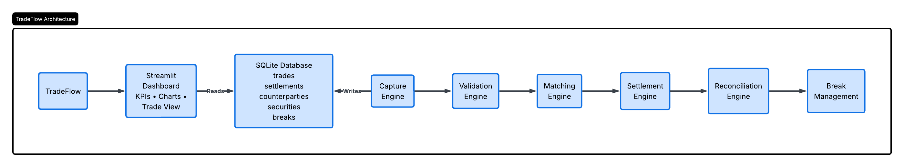

# TradeFlow

TradeFlow is a Python-based simulation of a post-trade operations platform used in capital markets. It models the complete lifecycle of an equity trade, from trade capture through settlement, while tracking operational exceptions using reconciliation and break management.

The project was built to better understand how post-trade operations teams process equity trades inside investment banks and financial institutions. It combines a modular Python backend, SQLite database, and a Streamlit dashboard to simulate real operational workflows.

---

## Dashboard Demo


---

## System Architecture



---

## Features

### Trade Capture

- Capture equity trades
- Store trade details in SQLite
- Maintain counterparty and security master data

### Trade Validation

- Validate mandatory trade fields
- Reject incomplete or invalid trades
- Apply basic business rules before processing

### Trade Matching

- Match validated trades
- Update trade lifecycle status

### Settlement Engine

- Simulate successful and failed settlements
- Calculate settlement amounts
- Store settlement status and failure reasons

### Reconciliation

- Compare trade and settlement records
- Detect settlement mismatches automatically

### Break Management

- Create operational breaks for failed settlements
- Track unresolved operational exceptions

### Operations Dashboard

- Built with Streamlit
- Interactive KPIs
- Trade inventory
- Settlement monitoring
- Counterparty exposure
- Daily trade volume
- Break analysis

---

## Trade Lifecycle

```
Trade Capture
      │
      ▼
Trade Validation
      │
      ▼
Trade Matching
      │
      ▼
Settlement
      │
      ├── Success
      │       │
      │       ▼
      │   Trade Settled
      │
      └── Failure
              │
              ▼
      Reconciliation
              │
              ▼
      Break Management
```

---

## Project Structure

```
tradeflow/
│
├── dashboard/
│   ├── app.py
│   └── pages/
│
├── data/
│   ├── schema.sql
│   ├── seed_data.py
│   ├── generate_sample_data.py
│   └── tradeflow.db
│
├── docs/
│   ├── architecture.png
│   └── dashboard_demo.gif
│
├── engines/
│   ├── capture.py
│   ├── validation.py
│   ├── matching.py
│   ├── settlement.py
│   ├── reconciliation.py
│   ├── master_data.py
│   └── init_db.py
│
├── tests/
│
├── requirements.txt
└── README.md
```

---

## Database

TradeFlow uses SQLite to model a simplified post-trade processing system.

The database contains the following tables:

- trades
- settlements
- counterparties
- securities
- breaks

Sample data is generated automatically to simulate realistic operational activity.

---

## Tech Stack

- Python
- SQLite
- Streamlit
- Pandas
- Plotly
- Faker

---

## Getting Started

Clone the repository.

```bash
git clone https://github.com/<your-username>/tradeflow.git
cd tradeflow
```

Create a virtual environment.

```bash
python -m venv venv
```

Activate it.

### Windows

```bash
venv\Scripts\activate
```

Install the required packages.

```bash
pip install -r requirements.txt
```

Initialize the database.

```bash
python engines/init_db.py
```

Generate sample data.

```bash
python data/generate_sample_data.py
```

Launch the dashboard.

```bash
streamlit run dashboard/app.py
```

---

## Sample Data

The sample data generator creates a realistic dataset that includes:

- 500+ simulated equity trades
- Security master data
- Counterparty master data
- Successful settlements
- Failed settlements
- Operational breaks

This allows the dashboard and reporting features to be explored without relying on external market data.

---

## What I Learned

This project gave me practical exposure to several concepts used in post-trade operations, including:

- Equity trade lifecycle
- Trade validation
- Trade matching
- Settlement processing
- Reconciliation workflows
- Operational break management
- Relational database design
- Building analytical dashboards with Streamlit
- Structuring Python applications using modular components

---

## Future Improvements

Some features I plan to add are:

- CSV and Excel trade import
- Advanced trade search and filtering
- Break resolution workflow
- Audit logging
- REST API
- User authentication
- Docker support
- Historical reporting

